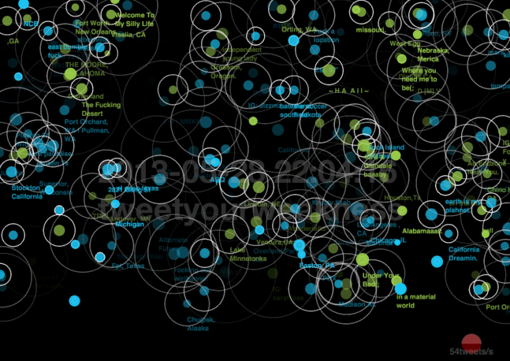

Byungkyu (Jay) Kang
---

  

An exploratory journey along social data streams

# Research

## Research Interests
I am interested in both foundation and application of Intelligent User Interfaces (IUI). Three major research fields are Artificial Intelligence and Human Computer Interaction(HCI) and Visual Data Analytics.  The motivation that walked me into the field of IUI was to develop intelligent interaction techniques for human.

* Machine Learning including Deep Learning
* Social Computing (Social Web Search & Mining / Information Reliability on the Web)
* User Interface Design and Human Factor Analysis
    - Visual Analytics: Interactive Data Analysis and Information Visualizations
    - Pattern Recognition (Vision, Image, Text and Graph)
    - Multimodal Interaction
* Cognitive Science – Human Perception and Recognition on the Web
* Media Art (Data Curation and Visualization)

## Work Experiences

* Intuit AI, San Diego, CA, March 2018 – Present
    - Question Answering, Predictive Churn Prediction, Recommender Systems, Clickstream-based Models
* Nokia Technologies, Sunnyvale, CA, September 2016 – March 2018
    - Big data analytics, AI-based intelligent user interfaces development.
* IBM T.J. Watson Research, Yorktown Heights, NY, May – September 2016
    - Dropout rate prediction, graph-based intelligent UI development.
* Adobe Research, San Jose, California, June – September 2014
    - Influential User Detection in Social Network (Social data analysis, Algorithm design and Interactive visualization)
* Yahoo! Labs Barcelona, Barcelona, Spain, June – September 2013
    - Research on entity-based exploratory and serendipitous search system, designing algorithm, user interface, and data visualization (LiMoSiNE project)
* Imaging Media Research Center (IMRC), Korea Institute of Science and Technology(KIST) in Seoul, South Korea, Jun – Aug 2012
    - Research on hand pose estimation using a single depth image
